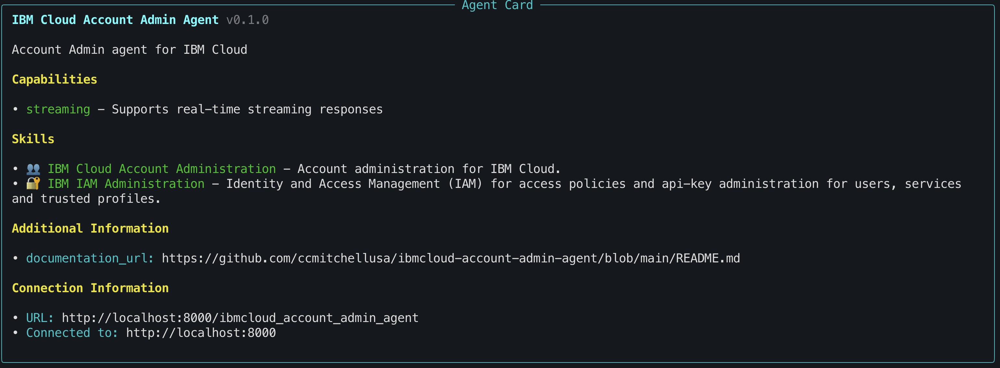

# ☁️ IBM Cloud 🤖 Agents

**Lightweight** Platform Engineering AI agents for IBM Cloud that have built-in access to IBM Cloud MCP tools.

## Features

- **🛠️ MCP-compliant IBM Cloud tools**: Each agent can easily be configured with its own list of IBM Cloud tools that it will use. The integrated [chuk-mcp](https://github.com/chrishayuk/chuk-mcp) library provides multi-server, production quality MCP implementation that is blazing FAST.  
- **Add MCP servers as needed** For agents that require additional tools (MCP servers), you can include them in the Containerfile as a build layer and within the agent configure them alongside the IBM Cloud MCP Server.
- **🪶Lightweight 🕵️ A2A-compliant**: A2A Protocol support is provided via [a2a-server](https://github.com/chrishayuk/a2a-server). Each agent is exposed on A2A endpoints with agent cards that can be easily configured (YAML).
- **📦 Runs on _any_ Container runtime**: Agent containers can be deployed on any container runtime, including Podman, Rancher, Docker™️,  Kubernetes, IBM Cloud Code Engine (serverless), or RedHat™️ OpenShift.
- **🧠 BYOM** - Bring your own model (must support 🛠️tool calling). The integrated [chuk-llm](https://github.com/chrishayuk/chuk-llm) library makes working with multiple model providers and models extremely SIMPLE--and FAST!
- **🕵️ Base Agent** - A base agent example is provided that can be easily customized with different models, tools and instructions to create new IBM Cloud platform engineering agents.

## ❤️ Keeping it simple

The common core of the agents is found in [`src/ibmcloud_base_agent/agent.py`](src/ibmcloud_base_agent/agent.py), which is a template for building other agents and has:

- 🧠Model connection - OpenAI, Anthropic, LiteLLM, etc.
- 🛠️IBMCloud MCP Server tool configuration for basic IBM Cloud commands to set target context and listing resource groups.
- 🕵️Agent 📃instructions - System prompt that defines the agents core behavior

This agent is the default agent that will appear when connecting to the server with a2a-cli (or other a2a client app).

## 🗜️Installation & Setup

1. Install [`uv`](https://docs.astral.sh/uv/)
2. Clone the repository:

```bash
git clone https://github.com/ccmitchellusa/ibmcloud-base-agent.git
cd ibmcloud-base-agent
```

3. Install dependencies:

```bash
uv sync --reinstall
```

## 🏃🏼Run the Agent Server (Local host)

Start the agent server locally:

```bash
./run.sh
```

Open browser on http://0.0.0.0:8000/agent-card.json to view card JSON. This verifies that the agents are running.

## Install an A2A Client

To connect to the agents over A2A protocol, you will need an A2A client.  The simplest A2A client which runs from the command line is  Chris Hay's [A2A CLI](https://github.com/chrishayuk/a2a-cli).  
In a separate shell, issue the following command to install and run the a2a-cli and connect it to the running agents.

```bash
uvx a2a-cli --server http://localhost:8000 chat
```

# Try Each Agent

There are multiple agents running in the default agent server configuration:

- Base Agent
- IBM Cloud Guide
- IBM Cloud Serverless Computing
- IBM Cloud Account Admin
- IBM Cloud Cloud Automation

You can use the `/connect` command in `a2a-cli` to switch between the agents, view their cards, and send prompts to the agents.

To switch to the **Base agent** while running a2a-cli, type:

```bash
/connect http://<host>:8000/ibmcloud_base_agent
```

The **Base agent**'s 📇agent card  should appear:


The base agent has some basic resource management capabilities built-in, like:

- Targetting an accounts, resource group, region, and cloud API endpoint.
- Listing resource groups
- Searching for resources using Lucene query syntax

Now, while still running `a2a-cli`, switch to the **IBM Cloud Guide agent**:

```bash
/connect http://<host>:8000/ibmcloud_serverless_agent
```

The **IBM Cloud Guide agent**'s 📇agent card will appear:


The guide agent is connected via MCP to an assistant that has been trained on all official sources of IBM Cloud documentation.

Try to ask a question, like:

```text 
Assist me with IBMCLOUD_TOPIC`
```
Some example topics:

- understanding the different parts of a CRN
- setting up an account structure for an enterprise

To switch to the **Serverless Computing agent** while running a2a-cli, type:

```bash
/connect http://<host>:8000/ibmcloud_serverless_agent
```

The **Serverless Computing agent**'s 📇agent card will be displayed:


Ask:

```text
What can you help me with?
```

You will see various serverless computing tasks that the agent can assist you with.  You'll want to start by listing the projects (code engine projects) that are currently avaialble in your account, and create one if none already exist.

Next switch to the **Account Admin agent**:

```bash
/connect http://<host>:8000/ibmcloud_account_admin_agent
```



and ask 

```text
What can you help me with?
```

You will see various management tasks for working with IBM Cloud accounts, users and IAM access policies and groups for users and services.  Try listing the users in your account (your agent will need an API Key with Admin access for this, and most of the capabilities of this agent).


To switch back to the Base agent, type 

```bash
/connect http://<host>:8000/ibmcloud_base_agent
```

## 🕵🏼‍♂️ Serverless Computing Agent Example

An example specialized agent for Serverless computing using Code Engine is found in `ibmcloud_serverless_agent/agent.py`, which has:

- 🧠LLM connection - LiteLLM
- 🛠️IBMCloud MCP Server tool configuration for Code Engine-related tasks
- 🕵️Agent 📃instructions for Serverless computing on IBM Cloud.

## 📦Containerization

### ⚙️Build

#### Build arguments

You can customize the build process by passing build arguments using the `--build-arg` flag. Below are the available build arguments:

| Argument           | Description                                                                         | Default Value                                         | Stage(s) Used  |
| ------------------ | ----------------------------------------------------------------------------------- | ----------------------------------------------------- | -------------- |
| `PYTHON_VERSION`   | Specifies the Python version to install.                                            | `3.12`                                                | Builder, Final |
| `IBMCLOUD_VERSION` | Specifies the version of the IBM Cloud CLI to install.                              | `2.35.0`                                              | Final          |
| `IBMCLOUD_ARCH`    | Specifies the architecture for the IBM Cloud CLI download (e.g., `amd64`, `arm64`). | `arm64`                                               | Final          |
| `IBMCLOUD_PLUGINS` | A comma-separated string of IBM Cloud CLI plugins to install                        | If not specified or empty, all plugins are installed. | Final          |


```bash
podman build --build-arg IBMCLOUD_PLUGINS="project" -t ibmcloud-base-agent:latest .
```

### ⚡️Deploy to local Podman, Rancher or Docker desktop

```bash
podman images ls
```

1. Get the image id that was pushed
2. Now run the image (on local podman)

#### Environment variables
```bash
IBMCLOUD_API_KEY=<Your IBMCloud API Key>
IBMCLOUD_REGION=us-south
IBMCLOUD_MCP_TOOLS=

LITELLM_PROXY_URL=
LITELLM_PROXY_API_KEY=
LITELLM_PROXY_MODEL=
```

```bash
podman run --rm -i -d --env-file=.env -p 8000:8000 ibmcloud-base-agent:latest
```

### Build and deploy to IBM Cloud container registry
In this example, agentic is your icr NAMESPACE and a2a is your REPOSITORY name.
Replace RESOURCE_GROUP with the name of the resource group where you want the container registry.

```bash
# Log docker into the IBM Cloud container registry at icr.io
ibmcloud cr login 
ibmcloud cr namespace-add -g RESOURCE_GROUP agentic
# Build the image and push it to the container registry in the 'agentic' namespace and 'a2a' repository.
docker build -f Dockerfile --push -t icr.io/agentic/a2a .

```

### 🏃Run from source code in IBM Cloud Code Engine

1. Navigate to Containers/Serverless/Projects
2. Create a project, eg. “A2A-play”
3. Navigate to “Applications”
4. Create application
 Name: ibmcloud-agent
 Code repo URL: https://github.com/ccmitchellusa/ibmcloud-base-agent

5. Navigate to "Optional settings"
	Image start options
		Listening port: 8000

6. Scroll back up to Code section.
7.  Select “Specify build details” > Next > Next >.
8. Select a container registry namespace
9. Select Done

### Connecting to remote agents running on IBM Cloud Code Engine

Connect [a2a-cli](https://github.com/chrishayuk/a2a-cli) to an agent running on Code Engine:

1. In the IBM Cloud console> Code Engine > Application page, click "Test Application" in upper right corner.  Copy the app's url.
2. Replace the url in the following snippet with the actual app's url from Step 1:

```bash
uvx a2a-cli --server https://ibmcloud-base-agent.1uo9xqkaspg3.us-east.codeengine.appdomain.cloud chat
# add --log-level DEBUG for detailed output
```

## 🤝Contributing

Contributions are welcome! Please follow these steps:

1. Fork the repository.
2. Create a new branch for your feature or bug fix.
3. Submit a pull request with a detailed description of your changes.

## 🪪License

This project is licensed under the [MIT License](LICENSE).

- Makefile based on the work of Mihai Criveti, from [MCP Context Forge](https://github.com/IBM/mcp-context-forge/blob/main/LICENSE) under Apache v2 License.
- Agent is based on [a2a-server](https://github.com/chrishayuk/a2a-server) under MIT License.
- [IBM Cloud MCP Server](https://github.com/IBM-Cloud/ibmcloud-mcp-server) is built into the containerized version of this agent.

## 👏Acknowledgments

- Special thanks to Chris Hay for the awesome work on a2a-server, a2a-cli, mcp-cli and the chuk-* collection of libraries and for providing inspiration for this project.
